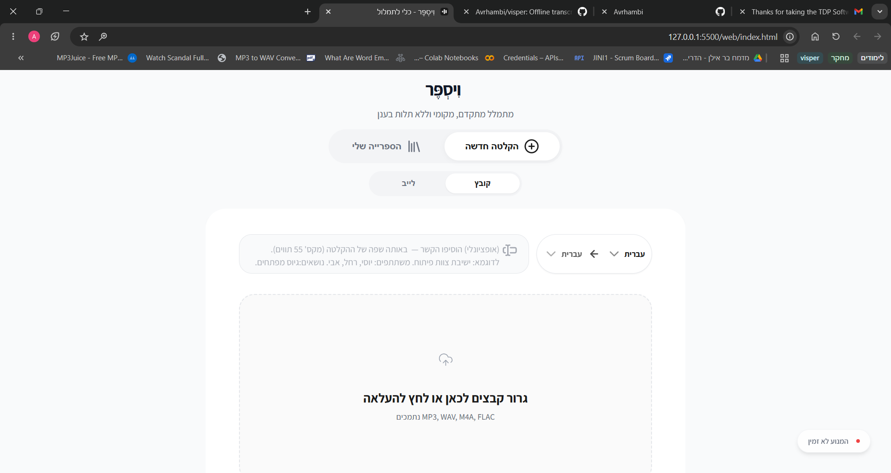
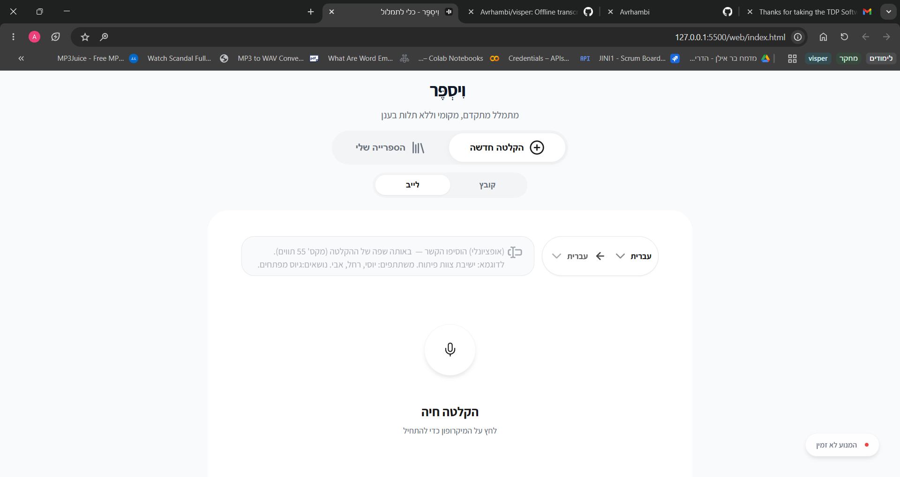
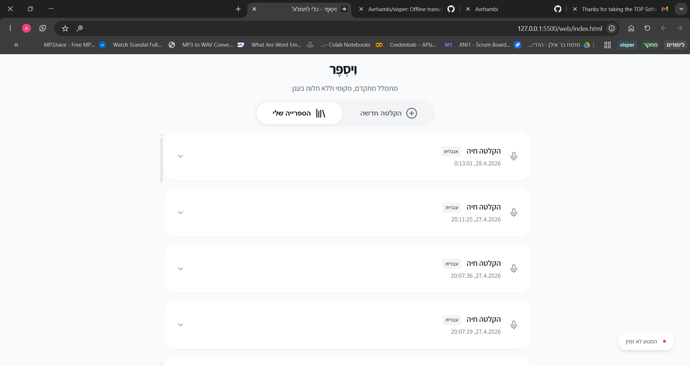

# Visper - Local transcription tool

Offline speech-to-text on your own hardware. No cloud, no subscriptions, no data leaves your machine. Self-benchmarks and configures itself on first run.

Supports Hebrew, English, Arabic, Russian, and other languages — each routed to the best model automatically. Translate any language to English in one flag.

**What's interesting about it:**
- Self-benchmarks all available backends on first run (CUDA / OpenVINO / CPU), picks the best, caches results permanently
- Falls back through a device chain at runtime if the primary fails; failure reasons are recorded, not silently dropped
- Single-owner parameter system: one module (`params.py`) owns all Whisper inference decisions, scaled to measured hardware headroom (RTF budget)
- Language routing swaps models on demand; only one model lives in memory at a time

---

## Setup (first time only)

```bash
git clone https://github.com/Avrhambi/visper && cd visper
python install.py
```

`install.py` installs dependencies, downloads the model (~1.5 GB), and runs the hardware benchmark. After that the model is cached and every subsequent start takes a few seconds.

Requires Python 3.10+ and [ffmpeg](https://ffmpeg.org) on PATH (WAV files work without it).

> **HuggingFace token:** If the model repo is gated, copy `.env.example` to `.env` and set `HF_TOKEN=hf_...` before running `install.py`.

---

## Web UI

```bash
visper-server          # starts the API on http://localhost:8000
```

Then open `web/index.html` in your browser. The page connects to `localhost:8000` automatically.







**Features:**
- Upload single or multiple audio files (MP3, WAV, M4A, and more) — or a whole folder
- Batch queue: sequential processing with per-file status, each result saved to library
- Live microphone recording with real-time transcription
- 12-language picker with automatic model routing
- **Translate to English** — one-click toggle for any non-English language
- Initial prompt field — seed Whisper with names, terms, or context to improve accuracy
- Transcription library saved locally in the browser; click any timestamp to seek audio
- RTL layout for Hebrew and Arabic; LTR for all other languages and translated output

---

## CLI

### `visper-file` — offline file transcription

```bash
visper-file audio.mp3                                      # transcribe → write audio.txt
visper-file audio.wav --output srt                         # SRT subtitles
visper-file audio.mp3 --output vtt                         # WebVTT subtitles
visper-file audio.mp3 --output json                        # JSON with segments, RTF, config
visper-file audio.mp3 --no-file --clip                     # print + copy to clipboard
visper-file audio.mp3 --progress                           # print each segment as it decodes
visper-file audio.mp3 --language he --translate            # transcribe Hebrew → English
visper-file audio.mp3 --language ar --translate            # transcribe Arabic → English
visper-file audio.mp3 --prompt "team meeting, Yossi, Rachel"
visper-file *.wav                                          # batch all WAV files
```

| Flag | Default | Description |
|------|---------|-------------|
| `--output` | from config | `txt` / `srt` / `vtt` / `json` |
| `--language` | `he` | `he` `en` `ar` `ru` `es` `fr` `de` `it` `pt` `zh` `ja` `ko` |
| `--translate` | off | Translate to English |
| `--prompt` | — | Context hint in the same language as the audio |
| `--bucket` | `auto` | Force bucket: `short` / `medium` / `long` / `extended` |
| `--progress` / `-p` | off | Print each segment to stderr as it decodes |
| `--no-file` | off | Print to stdout only, don't write a file |
| `--clip` | off | Copy final transcript to clipboard |
| `--accuracy` | from config | `fast` / `balanced` / `accurate` |
| `--profile` | from config | `foreground` / `background` / `minimal` |
| `--background` | off | Detach from terminal |

### `visper-live` — microphone / streaming

```bash
visper-live                                                # microphone
visper-live --file audio.mp3                               # file streaming mode
visper-live --output result.txt                            # save transcript on stop
visper-live --clip                                         # copy to clipboard on Ctrl+C
visper-live --language ru --prompt "meeting notes"
```

| Flag | Default | Description |
|------|---------|-------------|
| `--file` | — | Stream a file instead of the microphone |
| `--language` | `he` | Same language codes as `visper-file` |
| `--prompt` | — | Context hint applied to every chunk |
| `--output` | — | Write accumulated transcript to a file on stop |
| `--clip` | off | Copy accumulated transcript to clipboard on stop |
| `--progress` / `-p` | off | Print each segment with a wall-clock timestamp |
| `--accuracy` | from config | Override accuracy tier for the session |
| `--background` | off | Detach from terminal |

---

## REST API

`visper-server` exposes these endpoints alongside the web UI:

| Method | Path | Description |
|--------|------|-------------|
| GET | `/health` | Device, model, and status info |
| POST | `/transcribe` | Upload a file → `{text, segments, rtf}` |
| POST | `/transcribe/stream` | Upload a file → SSE stream of segment events |
| WS | `/ws/live` | WebSocket live microphone transcription |

```bash
curl -F "file=@audio.mp3" -F "language=he" http://localhost:8000/transcribe
curl -F "file=@audio.mp3" -F "language=he" -F "translate=1" http://localhost:8000/transcribe
# WebSocket: ws://localhost:8000/ws/live?language=he&translate=1
```

Without `visper-server` on PATH:

```bash
python -m uvicorn visper.server:app --port 8000
```

---

## Python API

```python
from visper import transcribe, stream_transcribe, transcribe_chunked

text = transcribe("audio.mp3")

def on_segment(seg):
    print(f"[{seg['start']:.1f}s] {seg['text'].strip()}")

text = transcribe_chunked("recording.mp3", on_segment=on_segment)

def on_transcript(text, is_final):
    print("FINAL:" if is_final else "...", text)

stream_transcribe(on_transcript)                # microphone
stream_transcribe(on_transcript, "audio.mp3")  # file
```

`is_final=True` — silence-gated (complete utterance). `is_final=False` — forced emit mid-speech.

---

## Configuration

Edit `config.yaml`. Key options:

| Key | Default | Options |
|-----|---------|---------|
| `accuracy_mode` | `auto` | `auto` / `fast` / `light` / `balanced` / `accurate` |
| `resource_profile` | `foreground` | `foreground` / `background` / `minimal` |
| `output_format` | `txt` | `txt` / `srt` / `json` |
| `vad_filter` | `true` | Enable Silero VAD |
| `max_chunk_seconds` | `28` | Max live chunk before forced emit |
| `audio_denoise` | `false` | Noise reduction (opt-in, adds ~1s per file) |
| `audio_highpass` | `false` | 80 Hz high-pass — removes HVAC rumble |
| `audio_normalize` | `false` | RMS normalization — helps whispered or far-mic audio |
| `hotwords` | `""` | Comma-separated terms to bias Whisper toward |
| `confidence_retry_enabled` | `null` | `null` = auto; retry at next tier on low confidence |

Full reference in `config.yaml`.

**Resource profiles**

| Profile | Threads | Priority | GPU | Model unload |
|---------|---------|----------|-----|--------------|
| `foreground` | benchmark result | normal | yes | never |
| `background` | 50% | low | yes | after 60s idle |
| `minimal` | 25% (max 2) | low | no | after 30s idle |

**Accuracy tiers** (when `accuracy_mode: auto`)

| Tier | beam_size | Auto-selected when |
|------|-----------|-------------------|
| `fast` | 1 | base RTF > 0.47 |
| `light` | 2 | base RTF 0.28–0.47 |
| `balanced` | 3 | base RTF 0.19–0.28 |
| `accurate` | 5 | base RTF < 0.19 |

---

## Benchmark

Runs automatically on first `install.py`. To re-run:

```bash
visper-benchmark           # all candidates, accurate RTF (~3–5 min)
visper-benchmark --fast    # primary device only (~60s)
visper-benchmark --force   # re-run even if results exist
visper-help                # full command reference
```

**Fallback chain:** `CUDA → OpenVINO HETERO → OpenVINO iGPU → OpenVINO CPU → CT2 CPU`

**Reference results (i5-1135G7 / MX350 / Iris Xe / 16 GB)**

| Device | Short | Medium | Long | Extended |
|--------|-------|--------|------|---------|
| CUDA int8_float32 | 0.55 | 0.18 | 0.16 | 0.13 |
| OpenVINO HETERO | 0.78 | 0.24 | 0.23 | 0.23 |
| OpenVINO iGPU | 0.79 | 0.26 | 0.23 | 0.23 |
| OpenVINO CPU | fail | 0.39 | 0.37 | 0.39 |
| CT2 CPU int8 | fail | 0.71 | 0.63 | 0.50 |

RTF — lower is faster; 1.0 = real-time. WER 0.179, CER 0.084 on 221 Hebrew files.

---

## Project Structure

```
install.py              ← one-time setup: deps, model download, benchmark
config.yaml             ← user-tunable parameters
web/index.html          ← web UI (open in browser after starting visper-server)
visper/server.py        ← FastAPI server (REST + SSE + WebSocket)
visper/api.py           ← public API: transcribe(), stream_transcribe(), transcribe_chunked()
visper/transcriber.py   ← faster-whisper / OpenVINO dispatch; audio pre-processing
visper/model_router.py  ← single-slot language-based model manager
visper/benchmark.py     ← hardware detection, candidate selection, fallback chain
visper/params.py        ← Whisper parameter selection per bucket/tier
visper/streamer.py      ← VAD-gated live transcription
visper/postprocess.py   ← text normalization
visper/resource.py      ← resource profile enforcement
visper/constants.py     ← audio constants
transcribe_file.py      ← CLI entry for visper-file
transcribe_live.py      ← CLI entry for visper-live
run_benchmark.py        ← CLI entry for visper-benchmark
records/                ← benchmark audio files
tests/                  ← standalone hardware validation scripts
```

---

## Contributing

See [ARCHITECTURE.md](ARCHITECTURE.md) for component boundaries and design decisions. Bug reports and PRs welcome.
